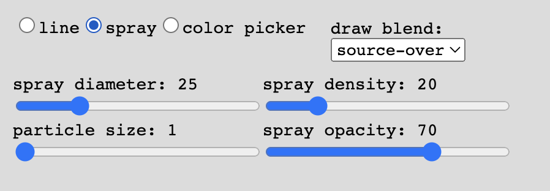

# Compression Drawing


Compression Drawing is a drawing tool that explores JPEG compression artifacts and recursive image processing.<br>

You can draw images on the canvas, save it, and then seamlessly place that saved image on the canvas to draw back on top of.<br>
The process of saving an image as a jpeg file is lossy, meaning some data can be lost every time it is saved and can't be restored. Over many repeated saves, visual distortions can start to emerge known as compression artifacts. While generally considered undesired, I find them aesthetically and conceptually interesting with how they age an image like how physical media deteriorates overtime. This tool was made to streamline the process of propigating these artifacts and add to them by drawing with each save. Utilize generation loss to find new textures and digitaly age your art.

It is made with [p5.js](https://p5js.org/) and the node package [GM](https://aheckmann.github.io/gm/) wraped in [Electron](https://www.electronjs.org/).<br>

## Select Examples:


[More can be found here.](readme-files/example-images)


# How do I work this thing?

## File Settings and Saving


All saved canvases can be found in the folder `/public/images/canvas` of this repository. Gifs are saved in the folder `/public/images/gifs`.

- The first input lets you name the save file for each compression of a current canvas. The default name is "thisCanvas". *Note: using an existing name will lead to the older files to be writen over.*
- The `reset img counter` button resets the internal counter that tracks how many saves have been executed. Above the button shows how many times the canvas has been compressed. Use this button after changing the file name so that it will start at zero.
- The `edit settings` check box when checked allows you to use the file name input and reset button. While active, the save buttons and drawing are disabled to avoid accidental saves or unwanted marks on the canvas.

- The `compress` button copresses the canvas and places the compressed save onto the canvas again following parameters set on the right side of the window. The tilde key `~` also has the same function. Using the button or the key rapidly at a fast speed can lead to an error form going faster than the canvas being compressed.
- The `save` button just saves the current canvas ignoring the compression settings. This is useful for saving in progress work while not advancing the counter and for saving the final results of a project.
- The `make_gif` button makes a gif out of all of the files with the name set in the file name input. *Note: using an existing name will lead to the older files to be writen over.*

## Drawing Tools
Select which tool to use by using the selection markers. When selected, the tools settings will appear for editing.
The `draw blend` dropdown selects the blending method for the drawing tools. Please refer to the [p5.js documentaion](https://p5js.org/reference/#/p5/blendMode) for a list of what each mode is capable of. 
### Line Tool


This is a basic pen-like tool.
- The `line size` slider adjusts the size of the line. It is on a scale of 1 to 100.
- The `line opacity` silder adjusts how transparent the line is. It is on a scale of 1 to 100.

### Spray Tool


This is a spray paint/air brush type of tool similar to ones found in MS Paint or Photoshop.
- The `spray size` slider adjusts the diameter of the spray. It is on a scale of 1 to 100.
- The `spray density` slider adjusts the density of spray particles from sparce to heavy. It is on a scale of 1 to 100.
- The `particle size` slider adjusts the size of the dots that make up the spray. It is on a scale of 1 to 10.
- The `spray opacity` slider adjusts the transparency of the spray particles. It is on a scale of 1 to 100.

### Color Picker


When selected, the mouse can be used to extract the color value of where it clicked on the canvas. Saving is disabled to avoid accidental compressions.

### Color Palette


- The `hue` slider selects the hue of the color.
- The `sat` slider selects the saturation of the color.
- The `lht` slider selects the lightness or darkness of the color.
- The large square to the right of the color sliders shows current color value that is selected for drawing.
- Below the color square is a twelve color palette for quick selection. Click one of the colors and that will become the current drawing color.

## Compression Settings
These setting pertain to how files are saved in the compression process and how those and other files are placed on the canvas.


- The `img blend` dropdown selects the blending method for images placed on the canvas, including drag and dropped files. Please refer to the [p5.js documentaion](https://p5js.org/reference/#/p5/blendMode) for a list of what each mode is capable of.
- The `quality` slider sets the jpeg quality during compression.
- The `opacity` slider sets the image transparancy when an image is placed on the canvas, including drag and dropped files.
- The `sample factor` slider sets the resolution of jpeg durring compression from a scale of 0.5 to 2
- The drag & drop fitting selection sets how image files that are dropped onto the window will be placed on the canvas. `Contain` will resize the dropped image so that it fits inside of the canvas. `Cover` will resize the image so that it fills the entire canvas. Images are placed relative to the center of the canvas.


- The `noise` slider sets the amount of noise added durring compression
- the `saturation` slider sets the amount of saturation applied durring compression.
- the `sharpness` slider sets the amount of a sharpen filter applied durring compression
- The channel adjust section sets the intensity of the `red`, `green`, and `blue` color channels durring compression. Positive values will increase the intensity, while negative values will decrease intensity. Having all sliders at the same values can lead to brightening an image with positive values and darkening an image with negative values.
  


- The `zoom` slider sets how zoomed in the image placed on the canvas will be after compressiom. The image is zoomed in relative to the center of the canvas.
- The `rotate` slider sets the degree in which the image placed on the canvas is rotated after compression. 
- The `jitter` slider sets the intensity for random scaling of the image placed on the canvas after compression.

<details><summary>*early draft*</summary>
- First of all, when you click the "compress" button in the lower left area that will compress the current canvas.  
- You can also press the tilde key (`~`) to also compress.  
- The sliders and options on the right will effect how the image is processed. A key slider, the one labeled "quality", determines the overall compression. Higher means less compression and lower mean more.

If you've used MS Paint then you'll feel slightly at home!  
- There are three drawing tools to use; line, spray, and color picker.  
- The line draws a line on the canvas. You can adjust the size and alpha/transparency.  
- The spray tool acts like a spray can. You can adjust the diameter of the spray, the dot size of the spray, the density of the dots, and the alpha/transparency of the spray.  
- Finally, the color picker will get the color value of whatever you click on inside of the canvas and will be used as the color for drawing tools.

To view your image files, enter the app directory and head into the `public` folder and then into the `images` folder.  
- Inside are two folders: `canvas` and `gif`. Your still images will be inside of the `canvas`.  
- **IMPORTANT:** remember to move your images to a new and safe location after you exit the app. If you don't and start it up again the new drawing will save over the old ones.</details>

# So... can I actually run it

<details><summary>To the person reading this: yes! (click for instuctions)</summary>
If you are familiar with Node, NPM, and using a command-line interface, this will be very straight forward. Prerequisites are Node.JS, NPM, and GraphicsMagick

If not, I recommend watching [this playlist](https://www.youtube.com/playlist?list=PLRqwX-V7Uu6b36TzJidYfIYwTFEq3K5qH) by The Coding Train that I watched when first starting this project. This will hopefully give you a good explanation of Node, NPM, and command-line usage.

*_Remember: use your command-line carefully and responsibly!_*

There's a few steps that need to be followed before that can happen though. Make sure you are connected to the internet for this as you'll be downloading a few things. You will also need to use a command-line interface for a lot of these steps. I do apologize for this current requirement as it is not the most user-friendly way if you are brand new to this, but I'll try to be as detailed as possible.
Small instructions disclaimer: Since I am using a Mac, I have not tried these steps on Windows.
1. [Download and install Node.js]([https://nodejs.org/en](https://nodejs.org/en/download)) for your operating system is. Make sure you download the LTS version (at the time of writing it is 18.17.0) as that will be the most reliable. This will also install NPM version 9.6.7.
2. Test to see if they were successfully installed by going to your computers command-line interface. On Mac use Terminal, on Windows use either CMD or Powershell. Once it's open, copy and paste this:
   ```
   node -v
   npm -v
   ```
   Press enter. It should display the installed versions something like this:
   ```
   v18.17.0
   9.6.7
   ```
4. Next go install [GraphicsMagick](http://www.graphicsmagick.org/) for your operating system. This is required for a node package the app uses (the one that dose all of the compressing and other stuff). On its own, GraphicsMagick is basically Photoshop but as a text adventure and free. (not necessary, but if you think GM cool, I recommend checking out [ImageMagick](https://imagemagick.org/index.php) too!)
1. Download/clone this repo. The whole thing. A way to do this on your browser is to go to the top of the main page of this repo and find the button that says `<> Code`. Click it and then click the `Download ZIP` option. Once downloaded, unzip it and move it to where ever you'd like it to be.
3. Back in your command-line, type `cd`, space, and then the path to the unzipped repo folder (i.e. `cd /the/path/to/Compression-Drawing`). Once that is typed up in the command-line, press enter. You should now be inside of Compression-Drawing within your command-line.
4. Now that you're in the directory, type `npm install` and press enter to download the necessary packages in the directory(this may take a minute)
5. Finally, type `npm start` and enter to run the app
and with that, fingers and toes crossed, it should be running on your computer!</details>

# Sources and Thanks

[p5.js Electron template](https://github.com/garciadelcastillo/p5js-electron-templates)<br>
[padded number algorithm](https://stackoverflow.com/a/43658705)<br>
[random point on a circumference algorithm](https://stackoverflow.com/a/9879291)<br>
[rgb to hsl algorithm](https://gist.github.com/mjackson/5311256)<br>
[line tool adapted from this p5.js example](https://p5js.org/examples/hello-p5-drawing.html)

Thank you:

- Chris Novello for the class you taught in 2017 I attended
- Daniel Shiffman for *The Code Train* youtube series
- Hito Steyerl for your *In Defense of the Poor Image* essay


